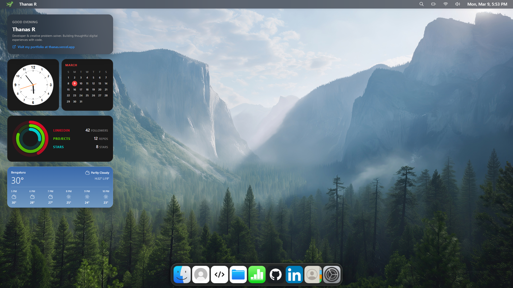

# ThanasOS

ThanasOS is a macOS themed portfolio website that recreates the experience of using a desktop inside the browser.  
Instead of navigating a traditional webpage, visitors interact with a desktop style interface where they can open apps, move windows, and explore different sections of the portfolio.

This project was one of the first websites where I started seriously building interactive interfaces and experimenting with UI design.

### Live site: <a href="https://thanas-os.vercel.app">thanas-os.vercel.app</a>

 

## Tech Stack

| Layer | Technology |
|------|------------|
| Framework | React + TypeScript |
| Build Tool | Vite |
| Styling | Tailwind CSS |
| Animations | Framer Motion |
| UI Concept | macOS Desktop Interface |

## What It Does

- Recreates a macOS style desktop environment in the browser  
- Allows users to open apps and move windows around the screen  
- Includes a dock with icon magnification  
- Provides quick navigation using spotlight style search (Cmd + K)  
- Supports light and dark themes with multiple wallpapers  
- Organizes portfolio sections as desktop apps  

## Key Idea

Instead of a traditional scrolling portfolio page, ThanasOS presents the portfolio as a **desktop operating system interface**.

Visitors explore projects and information the same way they would interact with applications on a computer.
