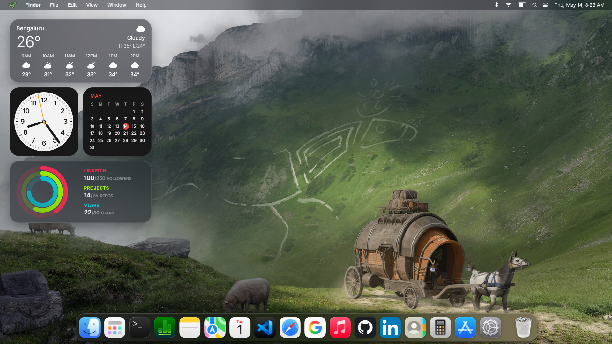

# ThanasOS [macOS - web]


> The best web iteration of macOS online.
>
> ThanasOS is a faithful, fully interactive recreation of macOS, rebuilt from the ground up for the browser.

ThanasOS started as a portfolio. It grew into something else: a long, deliberate attempt to rebuild the macOS experience inside a single React application, without iframes, without screenshots, and without shortcuts. Every window, dock icon, menu, widget, animation, and keyboard shortcut is a real component running in your browser.

## Live

[](https://thanas-os.vercel.app)

Built and maintained by **Thanas R**.

<a href="https://thanas-os.vercel.app">
  
</a>

[GitHub](https://github.com/thanas-r) · [LinkedIn](https://www.linkedin.com/in/thanasr/) · [Portfolio](https://thanas.vercel.app/) · [Old-Version](https://thanas-old.vercel.app/) 


## Table of Contents

1. [What ThanasOS Is](#what-thanasos-is)
2. [Highlights](#highlights)
3. [The Apps](#the-apps)
4. [Custom Widgets, Built From Scratch](#custom-widgets-built-from-scratch)
5. [System Features](#system-features)
6. [Tech Stack](#tech-stack)
7. [Architecture](#architecture)
8. [File Tree](#file-tree)
9. [Keyboard Shortcuts](#keyboard-shortcuts)
10. [Run Locally](#run-locally)
11. [Roadmap](#roadmap)
12. [License](#license)

---

## What ThanasOS Is

ThanasOS is a complete macOS shell living inside a single page web app. It boots, it has a login screen, it has a desktop, a menu bar, a dock, a launchpad, a control center, a notification center, a spotlight, a lock screen, a sleep screen, a restart screen, and over a dozen apps that actually do real work.

Every UI surface follows the macOS Tahoe "liquid glass" design language. Every interaction has a counterpart in the real OS. The goal was simple: make something that, on a desktop browser, feels like sitting in front of a Mac.

## Highlights

| Area | What we built |
|------|---------------|
| Window Manager | Drag, resize from any edge or corner, maximize, minimize, focus stack, z-order, traffic-light controls |
| Dock | Cosine-curve magnification, live indicators, app launching, minimize-to-dock |
| Menu Bar | Per-app dynamic menus, Apple menu, Bluetooth, Wi-Fi, Battery, Volume, Control Center, Notification Center, live clock |
| Spotlight | Cmd plus K to open, fuzzy search across apps, settings, notes, projects |
| Launchpad | Full-screen blurred grid, launch animations, exit animations |
| Boot Sequence | Welcome screen, Hello intro, lock screen, sleep, restart, all real screens |
| Theming | Light and dark with semantic tokens, brightness control, reduced motion |
| Wallpapers | 18 hand-picked wallpapers, custom upload support, crisp rendering |
| Cursors | macOS glove cursor system based on the apple_cursor (ful1e5) project |
| Mobile | Dedicated mobile fallback page since the experience is desktop-first |

## The Apps

Each app is a real React component, not an iframe and not a screenshot. They share state through the `MacOSContext` window manager.

| App | What it does |
|-----|--------------|
| Finder | File browser shell with sidebar and grid |
| Safari | Browser with three-CORS-proxy race, favorites tiles, history |
| Google (Chrome) | Optional second browser, installable via App Store |
| Launchpad | Full-screen app grid with morph animations |
| App Store | Install and uninstall optional apps like Google |
| Notes | Markdown blog with live rendering, search, sidebar list |
| Terminal | Command interpreter on a virtual filesystem with `ls`, `cd`, `cat`, `tree`, `grep`, `find`, `open`, `neofetch`, and more |
| Calendar | Month view with events |
| Maps | Mapbox-powered map with custom search |
| Calculator | Standard calculator |
| Settings | Full preferences panel: wallpaper, theme, dock, brightness, sound, network, default browser |
| About | About this Mac with live device info |
| Apple Music | Now-playing pill, playlists, embedded audio |
| GitHub | Live contribution graph, repos, stats |
| LinkedIn | Profile, experience, projects |
| Journey | Personal timeline embed |
| Technologies | Stack showcase |
| Contact | Form that posts to a server function |

## Custom Widgets, Built From Scratch

The desktop widgets are not third-party libraries. Each one was built specifically for ThanasOS.

| Widget | Notes |
|--------|-------|
| Utility Clock | Hand-drawn analog clock face with second-hand sweep, custom CSS animation |
| Calendar Widget | Month grid with today highlight |
| Bengaluru Weather | Live weather pulled at runtime |
| Stats Widget | CPU, memory, network and battery readouts |
| Time Widget | Compact digital clock |
| Now Playing Pill | Menu-bar player surface |
| Control Center | Tile grid with Wi-Fi, Bluetooth, AirDrop, Focus, brightness, volume |
| Notification Center | Stacked notifications with grouping |

## System Features

- Real window stacking with z-index focus changes
- Drag from title bar or any 28px top strip on integrated apps
- Resize from all four edges and all four corners
- Maximize that respects menu bar and dock bounds
- Auto-hide dock with hover-to-reveal
- Per-app menu registry: every app publishes its own File, Edit, View, Window menus
- Open links system: every external `<a>` opens in a new tab automatically
- Internal `openUrl` routes through the user's chosen default browser
- Spotlight search indexed across apps, settings keys, projects, notes
- Auto-closing menu bar dropdowns when the cursor moves more than 180px away
- Wallpaper preloading and decode for crisp render
- Battery API integration for real charge level
- Online and offline events surfaced in the menu bar

## Tech Stack

| Layer | Choice |
|-------|--------|
| Framework | React 18 with TypeScript |
| Build | Vite |
| Styling | Tailwind CSS with semantic tokens in `src/index.css` |
| Animation | Framer Motion plus hand-rolled CSS keyframes |
| Icons | lucide-react and react-icons |
| Markdown | react-markdown plus remark-gfm |
| Maps | Mapbox GL JS |
| Hosting | Vercel |

## Architecture

```
+-----------------------------------------------------------+
|  Apps           Safari, Notes, Terminal, Maps, Settings,  |
|                 Calendar, Calculator, GitHub, LinkedIn,   |
|                 AppleMusic, AppStore, Finder, Contact     |
+-----------------------------------------------------------+
|  Shell          MenuBar, Dock, Spotlight, Launchpad,      |
|                 ControlCenter, NotificationCenter, Window |
+-----------------------------------------------------------+
|  Context        MacOSContext: windows, settings, dock,    |
|                 openApp, focusWindow, updateSettings,     |
|                 openUrl, defaultBrowser routing           |
+-----------------------------------------------------------+
|  Lib            spotlightIndex, terminalFs, projects,     |
|                 blogPosts, bookmarks, installedApps,      |
|                 nowPlaying, githubContributions           |
+-----------------------------------------------------------+
```

## File Tree

```
src/
  App.tsx                    Root router and providers
  main.tsx                   ReactDOM bootstrap
  index.css                  Tailwind layers, design tokens, cursors, animations
  pages/
    Index.tsx                Loads the desktop or the mobile fallback
    NotFound.tsx             Standard 404
  contexts/
    MacOSContext.tsx         Window manager, settings, dock, openApp
  components/
    MobileFallback.tsx       Dedicated mobile landing page
    Mac.tsx                  Pure SVG mac frame for the mobile fallback
    WelcomeScreen.tsx        First-run welcome
    macos/
      Desktop.tsx            Mounts wallpaper, menu bar, dock, windows, widgets
      Window.tsx             Window chrome, drag, resize, traffic lights
      MenuBar.tsx            Apple menu, app menus, status icons
      Dock.tsx               Cosine magnification dock
      Spotlight.tsx          Cmd plus K search
      ControlCenter.tsx      Tile-based quick settings
      NotificationCenter.tsx Right-side stacked notifications
      LockScreen.tsx         Lock screen
      SleepScreen.tsx        Black sleep state
      RestartScreen.tsx      Restart progress
      HelloIntro.tsx         macOS hello intro
      ShortcutsModal.tsx     Keyboard shortcut sheet
      HelpModal.tsx          Help sheet
      FrostedModal.tsx       Reusable frosted panel
      NowPlayingPill.tsx     Menu-bar music pill
    apps/
      AboutApp.tsx           About this Mac
      AppStoreApp.tsx        Install or uninstall optional apps
      AppleMusicApp.tsx      Music player
      CalculatorApp.tsx      Calculator
      CalendarApp.tsx        Month view calendar
      ContactApp.tsx         Contact form
      FinderApp.tsx          Finder browser
      GitHubApp.tsx          Live GitHub profile
      GoogleApp.tsx          Optional second browser
      JourneyApp.tsx         Personal journey embed
      LaunchpadApp.tsx       Launchpad grid
      LinkedInApp.tsx        LinkedIn profile
      MapsApp.tsx            Mapbox map
      NotesApp.tsx           Markdown notes
      SafariApp.tsx          Default browser
      SettingsApp.tsx        System settings
      TechnologiesApp.tsx    Stack showcase
      TerminalApp.tsx        Shell with virtual FS
    widgets/
      BengaluruWeatherWidget.tsx
      CalendarWidget.tsx
      StatsWidget.tsx
      TimeWidget.tsx
      UtilityClockWidget.tsx
      utility-clock.css      Custom analog clock animation
    effects/
      AppleHelloEffect.tsx   Hello SVG stroke animation
    ui/                      shadcn primitives
  lib/
    blogPosts.ts             Notes content
    bookmarks.ts             Safari favorites
    githubContributions.ts   GitHub API helpers
    installedApps.ts         Optional-app registry, default browser routing
    nowPlaying.ts            Music metadata
    projects.ts              Project list
    spotlightIndex.ts        Spotlight search corpus
    terminalFs.ts            Virtual filesystem
    utils.ts                 cn helper
  hooks/
    use-mobile.tsx           Mobile detection
    useImagePreloader.tsx    Preload critical assets
    use-toast.ts             Toast hook
  types/
    macos.ts                 WindowState, MacOSSettings, AppConfig, MenuItem
  assets/                    Wallpapers, icons, profile images, screenshots
  integrations/supabase/     Cloud client
public/
  cursors/                   apple_cursor SVGs (default, pointing, open hand, closed hand, help, not-allowed)
  favicon.png                Turtle logo
  robots.txt
  placeholder.svg
supabase/
  functions/send-contact-email/index.ts   Contact-form server function
```

## Keyboard Shortcuts

| Shortcut | Action |
|----------|--------|
| Cmd plus K | Open Spotlight |
| Cmd plus W | Close window |
| Cmd plus M | Minimize window |
| Cmd plus Q | Quit app |
| Esc | Close focused window |
| Option Cmd Esc | Force quit all |
| Ctrl Cmd Q | Lock screen |

## Run Locally

```bash
git clone https://github.com/thanas-r/ThanasOS-liquid
cd ThanasOS-liquid
npm install
npm run dev
```

Open `http://localhost:5173`.

## Roadmap

Things planned but not yet built. Contributions welcome.

| Idea | Notes |
|------|-------|
| Reorderable Dock | Drag-and-drop with persisted ordering |
| Working Trash Bin | Closed windows land in Trash, can be restored |
| Mission Control | Expose all open windows with Cmd plus Up |
| Stage Manager | Side stack of recent windows |
| More Apps | Photos, Reminders, Stickies, Preview |
| File System | Real folders inside Finder, with drag-and-drop |
| Multi-Display | Cmd plus drag to a second virtual display |
| Live Wallpapers | Animated and dynamic wallpapers |
| Theme Builder | User-defined accent colors |
| Profiles | Save and switch user profiles |

## License

MIT. Use it, fork it, learn from it. A credit back is appreciated but not required.
